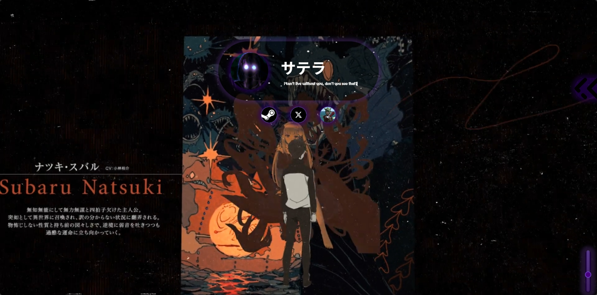
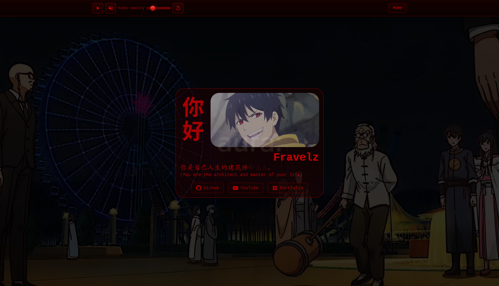

# Custom Web Profiles

Custom web profiles to use as a link on Discord or other platforms. I made this originally inspired by guns.lol, a site where you make your own profile prettier to link it on discord. I wanted to learn how to do it myself in a more basic and free way.

**If you would like to contribute your own page, I would be delighted to receive it!**

## Available Profiles

### 🌙 Satella

**Theme:** Re:Zero-inspired layout with medieval aesthetics  
**Live:** [View Satella profile](https://fonsicreus.github.io/Custom-Web-Profiles/pages/satella/satella.html)  
**Made by:** [Satella](https://github.com/Fonsicreus)

**Features:**

- Full-screen looping background video
- Interactive particles (particles.js) with dual layers
- Animated avatar (GIF) and Japanese username
- Social links to Steam, X (Twitter), and Discord
- Expandable biography panel (toggle with arrow button)
- Background music with custom volume slider
- Random hidden phrases displayed with typewriter effect
- Medieval-style typography (MedievalSharp)

**Screenshot:**

---

### 👑 King

**Theme:** The Daily Life of the Immortal King — red/black cyberpunk aesthetic  
**Live:** [View King profile](https://fonsicreus.github.io/Custom-Web-Profiles/pages/king/index.html)  
**Made by:** [Fravelz](https://github.com/fravelz)

**Features:**
- Full-screen background video with interactive controls
- Video controls header:
  - Play/Pause with SVG icons
  - Mute/Unmute toggle
  - Opacity slider (affects video and card inversely)
  - Reset button to restore default opacity
- Chinese greeting with vertical text orientation
- Animated Chinese characters using Hanzi Writer
- Red/black color scheme with monospace typography
- Responsive design with mobile optimizations

**Screenshot:**

---

## Credits

### Satella Profile
- **Background video:** [YouTube — 5XJAiHD8rXQ](https://www.youtube.com/watch?v=5XJAiHD8rXQ)
- **Particles library:** [particles.js](https://github.com/VincentGarreau/particles.js) (jsDelivr CDN)
- **Typography:** [Google Fonts — MedievalSharp](https://fonts.google.com/specimen/MedievalSharp)

### King Profile
- **Chinese character animation:** [Hanzi Writer](https://github.com/chanind/hanzi-writer) (jsDelivr CDN)
- **Typography:** Noto Sans SC (Chinese font)

## Contributing

Contributions are welcome! If you'd like to add your own profile page:

1. Create a new folder in `pages/your-profile-name/`
2. Add your HTML, CSS, and assets
3. Update this README with your profile information and screenshot
4. Submit a pull request

## License

This project is licensed under the [GNU General Public License v3.0](LICENSE).
